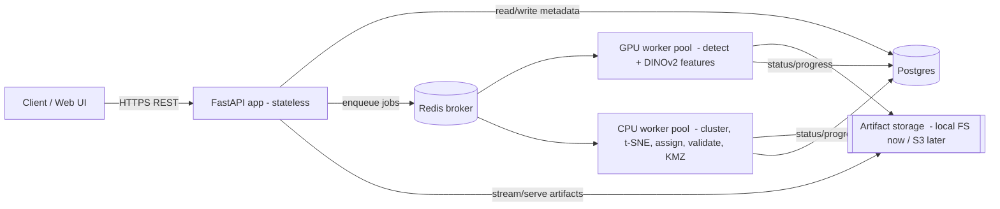
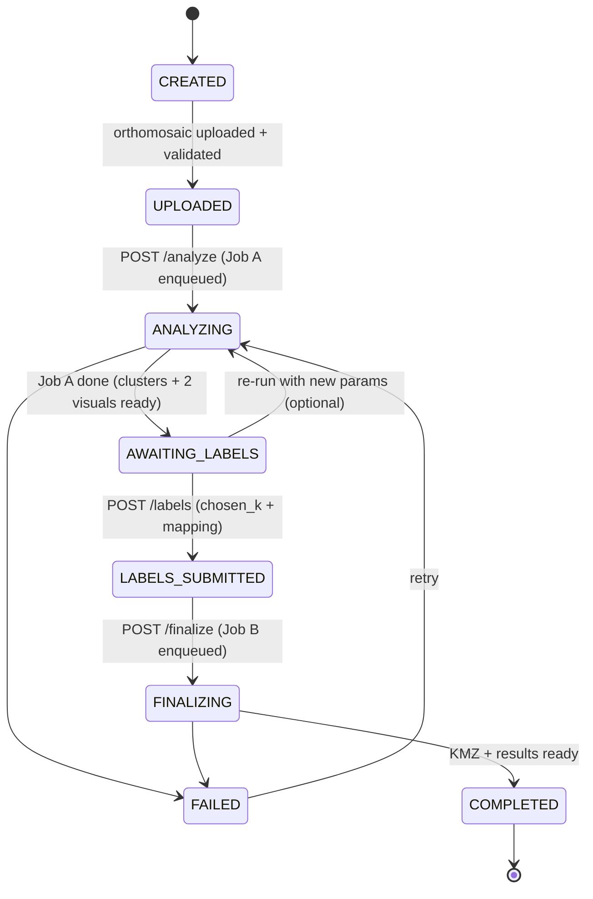

# Tree-Crown Species Pipeline — FastAPI Service Design

**Status:** Draft for review · **Audience:** you (the implementer) before any code is written
**Goal:** Wrap the existing 5-stage tree-crown pipeline in a multi-user FastAPI service where a user uploads an orthomosaic, the pipeline runs, the user reviews the **two cluster-analysis visuals** (t-SNE + k-selection), assigns species to clusters (with optional uploaded ground-truth labels), and downloads the final Google-Earth map.

---

## 1. The most important design fact

This pipeline **cannot be a single request → response**. Two properties force the design:

1. **It is long-running and heavy.** Detection (Detectree2 / Detectron2 Mask R-CNN), DINOv2 feature extraction, KMeans over several *k*, and t-SNE each take from tens of seconds to many minutes, and need a GPU/large CPU. A normal HTTP request would time out.
2. **It has a mandatory human-in-the-loop break in the middle.** After clustering, a human must *look at the clusters and the two visuals* and type a species name for each cluster. The pipeline literally stops and waits for a person.

So the service is a **stateful, stage-gated, asynchronous job system**, not a function call. Everything below follows from that. The pipeline is modeled as **two background jobs separated by a human gate**:

```
        JOB A (automated)                  HUMAN GATE                 JOB B (automated)
 ┌──────────────────────────────┐                          ┌──────────────────────────────┐
 Step 0 detect → Step 1 crop →   │   user reviews the two   │  Step 2 assign species →      │
 features → cluster → k-analysis │   visuals & submits      │  Step 3 validate (optional) → │
 → t-SNE   ───────────────────►  │   cluster→species labels │  Step 4 export KMZ            │
 └──────────────────────────────┘        ───────►          └──────────────────────────────┘
        ends in AWAITING_LABELS                                     ends in COMPLETED
```

---

## 2. What the existing code actually does (the contract we are wrapping)

This is the ground truth the API adapts to. Function names, inputs, and **output filenames** are taken directly from the repo.

| Phase | Function (file) | Reads | Writes (key artifacts) |
|---|---|---|---|
| Step 0 — Detect | `run_detectree2_pipeline(...)` (`predict.py`) | ortho `.tif`, model `.pth` | `downsampled.tif`, `tiles/`, `predictions/`, **`tree_crowns.geojson`**, **`overlay.png`** |
| (glue) | `step0_detection(config)` (`end_to_end_pipeline.py`) | above | copies ortho → `WORKDIR/ortho/image.tif`, geojson → `WORKDIR/polygons/crowns.geojson` |
| Step 1A — Crop | `step1_crop_crowns(config)` | `ORTHO_FOLDER/*.tif`, `POLY_FOLDER/*.geojson` | `STEP1_OUTPUT/crowns/{prefix}_{id:03d}.tif` |
| Step 1B — Features | `step1_extract_features(config, dir_crowns)` | crown tifs | `features/dinov2_features.npy`, `features/dinov2_features.csv`, `features/X_reduced.npy` |
| Step 1C — Cluster | `step1_cluster(config, X, names_df, dir_crowns)` | features | `clustering/k{k}_assignments.csv`, `clustering/k{k}/cluster_{i}/*.tif`, **`clustering/k{k}_cluster_species_map.csv`** (blank, for the human) |
| Step 1D — k analysis | `step1_analyze_k(...)` | metrics | **`clustering/k_selection.png`**, `clustering/k_recommendation_table.csv` (+ auto-recommended k) |
| Step 1E — t-SNE | `step1_tsne(...)` | features | `clustering/tsne_coordinates.csv`, **`clustering/tsne_k{k}.png`** (one per k) |
| **HUMAN GATE** | — | user inspects clusters | user fills `species` column in `k{chosen_k}_cluster_species_map.csv`, sets `CHOSEN_K` |
| Step 2 — Assign | `step2_assign_species(config)` | `k{CHOSEN_K}_cluster_species_map.csv`, `k{CHOSEN_K}_assignments.csv` | `step2_output/crown_master.csv`, `polygon_species.csv`, `pseudo_label_assignments.csv`, `species_folders/` |
| Step 3 — Validate (opt) | `step3_validate(config)` | `GROUND_TRUTH_CSV` (a **folder** of `species/*.tif`), `crown_master.csv` | `confusion_matrix.png`, `validation_detail.csv` (+ accuracy, Cohen's κ, macro-F1 printed) |
| Step 4 — Export | `step4_export_kmz(config)` | `crown_master.csv`, `POLY_FOLDER` | `step4_output/species_map.kmz` |

**The "two DAGs" the user reviews** = `tsne_k{k}.png` (cluster scatter, one per k) **+** `k_selection.png` (elbow / silhouette / Davies-Bouldin across all k). Both are produced by Job A and surfaced at the `AWAITING_LABELS` gate.

### Config attributes the pipeline functions expect

The pipeline reads a plain `config` object. The API must construct one **per project** with per-project paths:

`ORTHO_FOLDER, POLY_FOLDER, WORKDIR, DETECTREE_MODEL, TILE_SIZE, BUFFER, IOU_THRESHOLD, CONF_THRESHOLD, STEP1_OUTPUT, MODEL_NAME, IMG_SIZE, BATCH_SIZE, PCA_COMPONENTS, K_LIST, COPY_TO_CLUSTER_FOLDERS, CHOSEN_K, STEP2_OUTPUT, GROUND_TRUTH_CSV, STEP3_VALIDATION_OUTPUT, STEP4_OUTPUT, SOURCE_EPSG, COLOR_PALETTE`.

---

## 3. Architecture



**Components**

- **FastAPI app (stateless):** validates input, streams uploads to storage, creates/queries DB records, enqueues Celery tasks, serves status + artifacts. Never runs heavy compute in-process.
- **Celery + Redis:** task queue. Two logical queues:
  - `gpu` queue → detection (Step 0) and DINOv2 feature extraction (Step 1B). Concurrency capped to the number of GPUs to avoid VRAM contention.
  - `cpu` queue → cropping, clustering, k-analysis, t-SNE, assign, validate, KMZ.
- **Postgres (SQLAlchemy + Alembic):** projects, jobs, labels, state machine. Source of truth for status; Celery's own result backend is secondary.
- **Artifact storage:** one directory tree per project (Section 5). Abstract behind a small `Storage` interface so local FS today can become S3/MinIO later without touching route code.

> Why a real queue and not FastAPI `BackgroundTasks`: you chose **multi-user**. `BackgroundTasks` runs inside the web process, competes with request handling, dies on restart, and has no retry/visibility/concurrency control. Celery gives durable jobs, GPU concurrency limits, retries, and per-stage progress.

---

## 4. Project state machine

The project's `state` is the single value the UI polls. Sub-stage detail lives on the active `job`.



`job.current_stage` for Job A cycles through: `detecting → cropping → extracting_features → clustering → analyzing_k → tsne`.
For Job B: `assigning → validating → exporting`.

---

## 5. Per-project storage layout

Each project gets an isolated root. This maps the pipeline's hard-coded `Config` paths onto a per-project directory so concurrent jobs never collide.

```
storage/projects/{project_id}/
├── input/
│   ├── ortho/image.tif                 # uploaded orthomosaic (validated)
│   └── ground_truth/<species>/*.tif    # optional uploaded labels (Step 3 format)
└── work/                               # == Config.WORKDIR
    ├── detectree/                      # downsampled.tif, tiles/, predictions/, tree_crowns.geojson, overlay.png
    ├── ortho/image.tif                 # == Config.ORTHO_FOLDER
    ├── polygons/crowns.geojson         # == Config.POLY_FOLDER
    ├── step1_output/                   # == Config.STEP1_OUTPUT
    │   ├── crowns/                      # per-crown tifs  {prefix}_{id:03d}.tif
    │   ├── features/                    # dinov2_features.npy/.csv, X_reduced.npy
    │   └── clustering/                  # k{k}_*, k_selection.png, tsne_k{k}.png, k{k}/cluster_{i}/
    ├── step2_output/                   # crown_master.csv, polygon_species.csv, species_folders/
    ├── step3_output/                   # confusion_matrix.png, validation_detail.csv
    └── step4_output/                   # species_map.kmz
```

A `build_config(project, overrides)` adapter constructs the `Config` object pointing at these paths and merges user-supplied tuning params.

---

## 6. API endpoints

Base path `/api/v1`. All project-scoped routes require auth and check the project belongs to the caller. JSON unless noted. IDs are UUIDs.

### 6.1 Project lifecycle

**`POST /projects`** — create a project.
```jsonc
// request
{
  "name": "Sanjay Van — spot 3",
  "model_key": "urban_cambridge",  // which registered .pth to use (paracou | randresize | urban_cambridge)
  "source_epsg": 32643,            // optional; auto-detected from the GeoTIFF if omitted
  "params": {                       // all optional tuning overrides
    "tile_size": 10, "buffer": 10, "iou_threshold": 0.9, "conf_threshold": 0.85,
    "k_list": [2,4,6,8,10], "pca_components": 50, "batch_size": 16,
    "model_name": "vit_base_patch14_dinov2.lvd142m"
  }
}
// 201 response
{ "project_id": "…", "state": "CREATED", "created_at": "…" }
```

**`GET /projects`** — list (paginated): `[{project_id, name, state, updated_at}]`.
**`GET /projects/{id}`** — full detail: state, resolved config, available artifacts, active job id, error (if any).
**`DELETE /projects/{id}`** — remove project + all artifacts.

### 6.2 Uploads

**`POST /projects/{id}/orthomosaic`** — multipart upload of a GeoTIFF. **Callable multiple times** for a multi-ortho project (each upload is stored under a distinct stem, e.g. `s1_tree`, `s2_tree`, and detection runs once per ortho — see §9.4).
- Streamed/chunked to disk (these files are large; `examples/S3C.tif` ≈ 15 MB, but the real `ortho/s*.tif` here are ~hundreds of MB each).
- Validated with `rasterio.open` (must be a readable, georeferenced raster). CRS captured → fills `source_epsg` if not given.
- On success: `state → UPLOADED`. Response: `{ "state": "UPLOADED", "orthos": [{"stem","width","height","crs","bands"}, …] }`.

**`POST /projects/{id}/ground-truth`** *(optional)* — upload a `.zip` whose top-level folders are species names containing crown `.tif` files (exactly the structure `step3_validate` expects). Unzipped to `input/ground_truth/`. Can be uploaded any time before `finalize`.

### 6.3 Phase A — detect + cluster

**`POST /projects/{id}/analyze`** — enqueue **Job A**.
- Preconditions: `state == UPLOADED` (or re-run from `AWAITING_LABELS`/`FAILED`).
- Body (optional): per-run param overrides (same shape as `params` above) — lets the user re-cluster with a different `k_list` without re-uploading.
- Server uses the configured Detectree2 weights path (`DETECTREE_MODEL`, set server-side since detection is wired as-is).
- `state → ANALYZING`. Response: `{ "job_id": "…", "type": "analyze", "state": "QUEUED" }`.

**`GET /jobs/{job_id}`** — poll job status.
```jsonc
{
  "job_id": "…", "project_id": "…", "type": "analyze",
  "state": "RUNNING",                 // QUEUED | RUNNING | SUCCEEDED | FAILED
  "current_stage": "extracting_features",
  "progress": 0.42,                    // best-effort 0..1
  "log_tail": ["Tiles created: 128", "Images to process: 640", "…"],
  "error": null,
  "started_at": "…", "updated_at": "…"
}
```

**`GET /projects/{id}/events`** *(optional, recommended for UI)* — Server-Sent Events stream of the same status so the front end shows live progress instead of polling.

### 6.4 The human-in-the-loop review — **the two DAGs**

Available once `state == AWAITING_LABELS`.

**`GET /projects/{id}/clustering`** — the review payload (centerpiece of the whole product):
```jsonc
{
  "available_k": [2,4,6,8,10],
  "recommended_k": 6,                  // from k_recommendation_table.csv (rank 1)
  "k_recommendation_table": [          // parsed from CSV → JSON
    {"k":6,"inertia":…,"silhouette":…,"davies_bouldin":…,"combined_score":…,"rank":1},
    …
  ],
  "k_selection_plot_url": "/api/v1/projects/{id}/clustering/k-selection.png",   // DAG #2
  "per_k": [
    { "k": 6,
      "tsne_plot_url": "/api/v1/projects/{id}/clustering/6/tsne.png",           // DAG #1
      "clusters_url":  "/api/v1/projects/{id}/clustering/6/clusters" }
  ],
  "detection_overlay_url": "/api/v1/projects/{id}/detection/overlay.png"
}
```

**`GET /projects/{id}/clustering/k-selection.png`** → serves `clustering/k_selection.png` (**DAG #2**, across all k).
**`GET /projects/{id}/clustering/{k}/tsne.png`** → serves `clustering/tsne_k{k}.png` (**DAG #1**, per k).
**`GET /projects/{id}/clustering/{k}/clusters`** → for the chosen k, lists each cluster with thumbnail URLs so the user can *see* what's in a cluster before naming it:
```jsonc
{ "k": 6, "clusters": [
    { "cluster": 0, "count": 142, "sample_crowns": ["/api/v1/projects/{id}/crowns/crowns_000.png", …] },
    …
]}
```
**`GET /projects/{id}/crowns/{image_name}`** → serves a single crown rendered as PNG (the stored crowns are GeoTIFFs; render to PNG on the fly for the browser). Names follow `{prefix}_{id:03d}` (after detection the prefix is `crowns`, e.g. `crowns_017`).
**`GET /projects/{id}/detection/overlay.png`** → serves `detectree/overlay.png`.

### 6.5 Submit labels (closes the human gate)

**`POST /projects/{id}/labels`**
```jsonc
// request
{
  "chosen_k": 6,
  "mapping": [
    { "cluster": 0, "species": "acacia",     "notes": "thorny, fine canopy" },
    { "cluster": 1, "species": "non_acacia", "notes": "" },
    …                                       // any cluster left out → "unlabelled"
  ]
}
// 200 response
{ "state": "LABELS_SUBMITTED", "chosen_k": 6, "species_counts_preview": {"acacia": 3, "non_acacia": 2, "unlabelled": 1} }
```
Server validation + side effects:
- `chosen_k` must be in `available_k`.
- Persist mapping to DB **and** write `clustering/k{chosen_k}_cluster_species_map.csv` in exactly the schema `step2_assign_species` reads (`cluster, cluster_folder, species, notes`), and set `config.CHOSEN_K`.
- Species strings normalized the same way the pipeline does (`lower`, spaces/hyphens → `_`).
- `state → LABELS_SUBMITTED`.

### 6.6 Phase B — assign + validate + export

**`POST /projects/{id}/finalize`** — enqueue **Job B** (Step 2 → Step 3 if ground-truth present → Step 4). Returns a `job_id`; poll via `GET /jobs/{job_id}`. `state → FINALIZING`, then `COMPLETED`.

### 6.7 Results

**`GET /projects/{id}/results`**
```jsonc
{
  "state": "COMPLETED",
  "species_distribution": { "acacia": 325, "non_acacia": 303 },
  "validation": { "accuracy": 0.84, "cohen_kappa": 0.67, "macro_f1": 0.83 },  // null if no ground truth
  "downloads": {
    "kmz": "/api/v1/projects/{id}/results/kmz",
    "crown_master_csv": "/api/v1/projects/{id}/results/crown-master.csv",
    "polygon_species_csv": "/api/v1/projects/{id}/results/polygon-species.csv",
    "confusion_matrix_png": "/api/v1/projects/{id}/results/confusion-matrix.png"  // null if no ground truth
  }
}
```
**`GET /projects/{id}/results/kmz`** → `species_map.kmz` (`application/vnd.google-earth.kmz`).
**`GET /projects/{id}/results/crown-master.csv`**, **`/polygon-species.csv`**, **`/confusion-matrix.png`** → respective files.

---

## 7. Full client flow (sequence)

```mermaid
sequenceDiagram
  participant U as Client
  participant A as FastAPI
  participant W as Worker (Celery)
  U->>A: POST /projects                      ;; CREATED
  U->>A: POST /projects/{id}/orthomosaic     ;; UPLOADED (validated by rasterio)
  U->>A: POST /projects/{id}/ground-truth    ;; optional
  U->>A: POST /projects/{id}/analyze         ;; ANALYZING, returns job_id
  A->>W: enqueue Job A (detect→…→tsne)
  loop poll
    U->>A: GET /jobs/{job_id}                ;; stage + progress
  end
  W-->>A: Job A done                          ;; AWAITING_LABELS
  U->>A: GET /projects/{id}/clustering        ;; the TWO visuals + cluster thumbnails
  U->>A: POST /projects/{id}/labels           ;; LABELS_SUBMITTED (writes species_map.csv)
  U->>A: POST /projects/{id}/finalize         ;; FINALIZING, returns job_id
  A->>W: enqueue Job B (assign→validate→kmz)
  W-->>A: Job B done                          ;; COMPLETED
  U->>A: GET /projects/{id}/results           ;; metrics + download links
  U->>A: GET /projects/{id}/results/kmz       ;; species_map.kmz
```

---

## 8. Data model (Postgres)

```
projects(
  id uuid pk, user_id, name, state,
  config_json jsonb,            -- resolved params (tile_size, k_list, …)
  source_epsg int,
  recommended_k int, available_k int[],   -- filled after Job A
  error text, created_at, updated_at
)
jobs(
  id uuid pk, project_id fk, type,        -- 'analyze' | 'finalize'
  state, current_stage, progress real,
  log_tail jsonb, error text,
  celery_task_id, started_at, finished_at
)
cluster_labels(
  id pk, project_id fk, chosen_k int,
  cluster_id int, species text, notes text
)
```

---

## 9. Required changes to the existing pipeline code

These are correctness/robustness fixes the API depends on. Each is small but **non-optional for multi-user**. **Items 1–3 are now applied to the repo** (this is the "patch the pipeline first" step); items 4–6 remain for the API build.

1. ✅ **APPLIED — `predict.py` no longer writes predictions to a shared CWD.** Previously `default_pred_dir = os.path.join(os.getcwd(), "predictions")` plus `detectree2.predict_on_data`'s relative output meant concurrent jobs collided. Now detection runs inside a `with _pushd(output_dir):` context manager so Detectree2's relative `predictions/` lands inside the job's own `output_dir`, and the collector searches the likely locations and consolidates into `pred_dir`. (`os.chdir` is process-global, so detection tasks must run on **prefork** workers — one task per process — which is the recommended GPU-queue setup anyway.)

2. ✅ **APPLIED — `predict.py` now selects CUDA.** Device order is now `cuda → mps → cpu` (it previously picked `mps` else `cpu`, silently running on CPU on a Linux GPU box). Lives in the new `build_predictor(...)` helper.

3. ✅ **APPLIED (refactor) — models are now warm-loadable.** Detectron2 predictor creation is extracted into `predict.build_predictor(...)`, and DINOv2 into `tree_crown_pipeline.build_dinov2(...)`. `run_detectree2_pipeline(..., predictor=None)` and `step1_extract_features(..., model=None)` accept a preloaded instance, so a worker loads each ~500 MB model **once per process** and reuses it. Both changes are backward compatible — passing nothing reproduces the original CLI behaviour.

4. **Multi-orthomosaic detection (decision: configurable).** `run_detectree2_pipeline` (via `resolve_ortho_path`) processes one `.tif`, while `step1_crop_crowns` already loops over *all* tifs in `ORTHO_FOLDER`. Per the chosen **configurable** model, the API orchestrates this by calling detection **once per ortho** into a per-ortho namespace (distinct GeoJSON prefix so crown filenames stay unique), then runs a single Step 1 over the combined `ortho/` + `polygons/` folders. No core change to the detection function is required for this — it stays a clean per-ortho call.

5. **Heavy prints / `tqdm` to stdout** — fine, but capture stdout per task into `job.log_tail` so the API can surface progress, and parse known lines (`"Images to process: N"`, `"Tiles created: N"`) into `progress`.

6. **`config.GROUND_TRUTH_CSV` is actually a folder path** — keep that semantics; the API just points it at `input/ground_truth/` and only runs Step 3 if that folder is non-empty.

---

## 10. Cross-cutting concerns

- **Auth:** API key or OAuth2 bearer; every project carries `user_id`; all routes authorize ownership. (Keep minimal for v1 but design it in.)
- **Upload limits & streaming:** enforce a max size, stream to disk (don't buffer GBs in memory), reject non-raster files early via `rasterio`.
- **GPU contention:** dedicate the `gpu` queue, set worker `--concurrency` = GPU count; everything else on `cpu` workers that can scale horizontally.
- **Idempotency / resume:** the pipeline already caches `dinov2_features.npy` and `tsne_coordinates.csv`; a re-run of Job A resumes cheaply. Make tasks safe to retry.
- **Timeouts & failure:** Celery soft/hard time limits per stage; on exception, set `job.state=FAILED`, `job.error=<stage + traceback>`, `project.state=FAILED`, and expose via `GET /jobs/{id}`.
- **Cleanup / cost:** `crowns/`, `tiles/`, `species_folders/` get large (thousands of tifs). Add a TTL/cleanup job and the `DELETE` endpoint.
- **Storage abstraction:** wrap reads/writes in a `Storage` interface (local FS now) so S3/MinIO is a drop-in later.
- **Observability:** structured logs keyed by `project_id`/`job_id`; Flower (or similar) for queue visibility.

---

## 11. Open decisions for you

1. ✅ **RESOLVED — Model selectable per project, with a fixed default.** All three weight files are registered server-side; `POST /projects` takes a `model_key` and the chosen `.pth` flows into `DETECTREE_MODEL`. If `model_key` is omitted, the server uses the **default: `urban_cambridge`**. Registry:

   | `model_key` | file | default |
   |---|---|---|
   | `urban_cambridge` | `urban_trees_Cambridge_20230630.pth` | ✅ yes |
   | `paracou` | `220723_withParacouUAV.pth` | |
   | `randresize` | `230103_randresize_full.pth` | |
2. ✅ **RESOLVED — Orthos configurable.** One ortho per project by default, but a project may hold several (uploaded individually). Detection is orchestrated once per ortho (see §9.4); Step 1 runs once over the combined set.
3. **Auth scope** — single internal tool vs. public multi-tenant? Affects how much auth/quota to build now.
4. **Optional "skip detection" entry point** — allow uploading a ready-made crown GeoJSON (like `examples/s3_tree.geojson`) to bypass Step 0? Cheap to add and great for testing; not in the core flow per your choice.
5. **Re-labeling** — allow a completed project to be re-labeled with a different `chosen_k` and re-finalized without re-running Job A? (The artifacts support it.)

---

## 12. Suggested repository layout

```
app/
  main.py                 # FastAPI app, router mounts, middleware
  core/
    settings.py           # env config (DB, Redis, storage root, model path)
    storage.py            # Storage interface (local FS now)
    security.py           # auth
  api/v1/
    projects.py           # create/list/get/delete + uploads
    analyze.py            # POST /analyze, job status
    clustering.py         # the two-DAGs review endpoints
    labels.py             # POST /labels
    finalize.py           # POST /finalize
    results.py            # results + downloads
  db/
    models.py             # SQLAlchemy
    session.py
    migrations/           # Alembic
  schemas/                # Pydantic request/response models
  services/
    pipeline_adapter.py   # build_config(project, overrides); CSV<->JSON helpers
    project_service.py    # state transitions, validation
  workers/
    celery_app.py
    tasks.py              # job_a_analyze(), job_b_finalize(); per-stage progress
pipeline/                 # existing code, lightly patched (see §9)
  predict.py
  tree_crown_pipeline.py
requirements-api.txt      # fastapi, uvicorn[standard], celery, redis, sqlalchemy,
                          # alembic, psycopg2-binary, python-multipart, pydantic-settings
```

---

## 13. Build order (once this design is approved)

1. Scaffold app + settings + DB models + Alembic; `POST /projects`, `GET /projects/{id}`.
2. Streaming orthomosaic upload + `rasterio` validation.
3. `pipeline_adapter.build_config`; patch the §9 items (CWD isolation, CUDA, model singletons).
4. Celery + Redis; `job_a_analyze` calling Step 0 + Step 1 with stage progress → `AWAITING_LABELS`.
5. The two-DAGs review endpoints (`/clustering`, plot serving, cluster thumbnails, crown PNG rendering).
6. `POST /labels` (DB + write `k{chosen_k}_cluster_species_map.csv`).
7. `job_b_finalize` (Step 2 + 3 + 4); results + downloads.
8. Ground-truth zip upload + validation wiring.
9. Auth, limits, cleanup, SSE progress, tests.

---

### TL;DR

A two-job, stage-gated async service. **Job A** runs detect→cluster and parks the project at `AWAITING_LABELS`, where the user sees the **two DAGs** (`tsne_k{k}.png` + `k_selection.png`) plus per-cluster crown thumbnails. The user `POST`s a `chosen_k` + cluster→species mapping (optionally after uploading ground-truth labels), which the server turns into the `k{chosen_k}_cluster_species_map.csv` the pipeline already reads. **Job B** runs assign→validate→export and produces the downloadable `species_map.kmz` + metrics. Multi-user safety hinges on the three small pipeline patches in §9 — chiefly isolating Detectree2's CWD writes.
